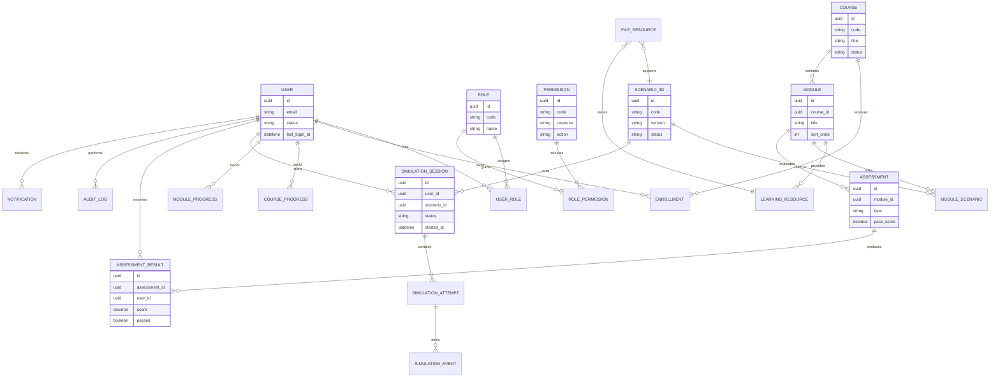

# ERD Conceptual

## Notas

- El ERD es conceptual, no fisico.
- `SIMULATION_EVENT` puede terminar en almacenamiento relacional o documental segun volumen final.
- `FILE_RESOURCE` representa metadata; el binario debe vivir en object storage.
- `COURSE_PROGRESS` y `MODULE_PROGRESS` pueden ser tablas materializadas o vistas consolidadas, segun estrategia final.

